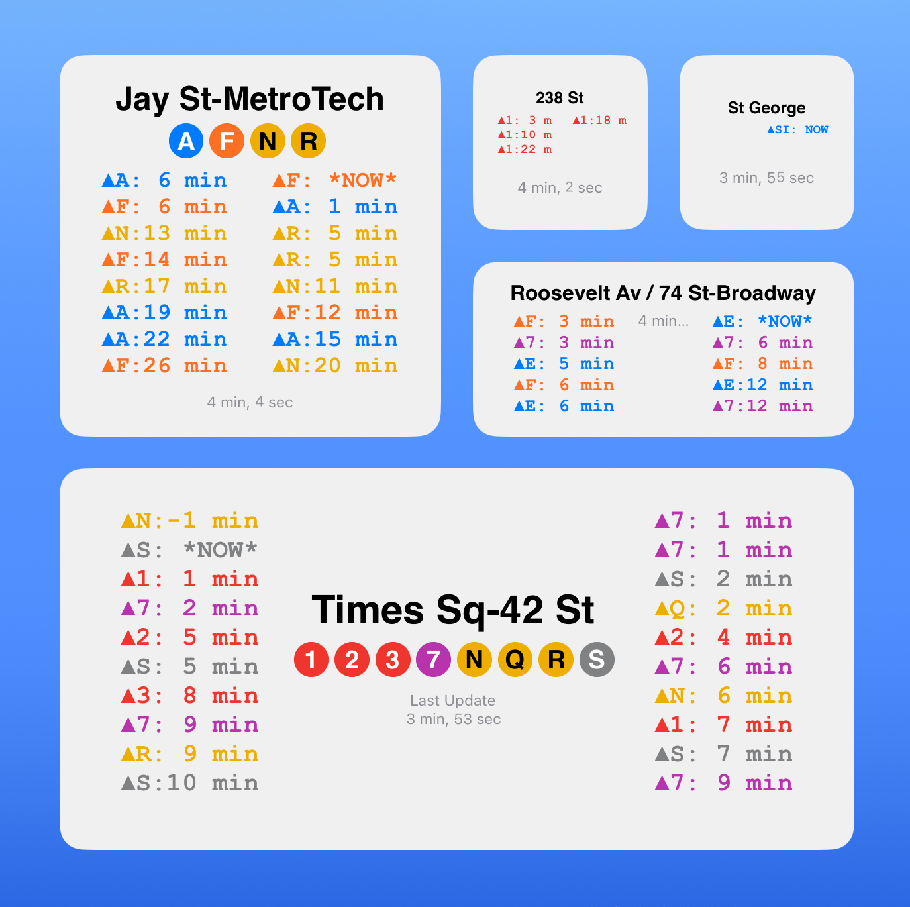

[中文](README.md#L83) [English](README.md#L3)

> English
# Scriptable Widget MTA Subway Train Reminder
 Scriptable Widget MTA Subway Train Reminder

 by Silver

# Inspiration
I really love the concept from https://wheresthefuckingtrain.com/ which simplifies the directions into just two.

Also in this stage I use its API to quickly make this widget.

In the future I may link my own API from MTA.

# Screenshot
<!--  -->

# Legend
▲: Uptown/Manhattan

▼: Downtoan/Brooklyn

Just remember that Manhattan is the core of NYC Subway.

# Setup
 - Download the app "Scriptable" from iOS/iPadOS App Store
 - Copy the code into a new script.
 - Add a Scriptable widget to your iPhone/iPad home screen. There are 3 sizes on iOS or 4 sizes on iPadOS .
 - Set the widget to the script you just created.
 - You are all set!

# Modes and Parameters
## 1. Local Position (Default)

Use your location to find the nearest subway station.

Need the permission to get location.

No parameters or unrecognised/unruled paremeters will arise this mode.

## 2. Coordinate 
Find a subway station in Google Maps or any other.

Copy and edit its GPS Coordinate in this format:

(40.8278609, -73.9254583)

Long press the widget and find the setting panel.

Paste the coordinate to the "Parameter" textfield.

The script will automatically decode this string and get the station.

* There is of course no accurate coordinate for subway station. So just finding any GPS coordinate around the subway station is enough. Magic will happen.

* For Chinese users, please be sure to use English punctuation marks (,)

## 3. Favorite Coordinate
Add your favorite stations and make it easy to be set by just typing number 1/2/3 as parameter.

Record these stations' coordinate in the script.

You can see them in the beginning.

Edit the variable myF1/myF2/myF3.

For example:

let myF1="**(40.6922632, -73.9868766)**" //default: Jay St MetroTech

# Misc
 - Subject to the system limit, the widget might **NOT** fresh the content as soon as we want. You can click to refresh.
 - The good news is the timer you see shows the relative time to the last refresh time which will help you refer to offset by calculating.
 - Pay attention! Since we simplify the directions, so you **CANNOT** see the difference of multiple terminal destinations. For example, A train may have multiple terminal stations including Ozone Park–Lefferts Blvd and Far Rockaway-Mott Av. Sometimes A train may also stop at the middle station as terminal station like Euclid Av. Please refer to MTA official website and broadcast in this case.

> 中文

# Scriptable小组件MTA地铁列车提醒
 Scriptable小组件MTA地铁列车提醒

 Silver制作

# 灵感
我非常喜欢 https://wheresthefuckingtrain.com/ 的概念，它将方向简化为两个。

目前我使用了它的API来快速制作这个小组件。

将来我可能会链接到自己的MTA API。

# 截图
<!--  -->

# 图例
▲: 上城/曼哈顿

▼: 下城/布鲁克林

始终记住曼哈顿是纽约地铁的核心。

# 设置
 - 从iOS/iPadOS App Store下载"Scriptable"应用程序
 - 将代码复制到一个新脚本中。
 - 在iPhone/iPad主屏幕上添加一个Scriptable小组件。iOS上有3种尺寸，iPadOS上有4种尺寸。
 - 将小组件设置为刚刚创建的脚本。
 - 完成基本设置！

# 模式和参数
## 1. 本地位置（默认）

使用您的位置查找最近的地铁站。

需要获取位置的权限。

此模式不需要参数。无法识别/非法的参数也将激活此模式。

## 2. 坐标
在Google地图或其他地图中找到一个地铁站。

复制并编辑其GPS坐标，格式如下：

(40.8278609, -73.9254583)

长按小组件，找到设置面板。

将坐标粘贴到"参数"文本框中。

脚本将自动解码此字符串并获取站点。

* 地铁站自然是没有准确的坐标。所以只需找到地铁站附近的任何GPS坐标即可。匹配工作交给脚本吧。

* 对于中文用户，请确保使用的是英文标点符号 (,)

## 3. 收藏坐标
添加您喜爱的站点，只需键入1/2/3作为参数即可轻松设置。

在脚本中记录这些站点的坐标。

您可以在脚本的开头看到它们。

编辑变量myF1/myF2/myF3。

例如：

let myF1="**(40.6922632, -73.9868766)**" //默认：Jay St MetroTech

# 其他事项
 - 受系统限制，小组件可能**不会**立即刷新内容。可设置为手动点击重新运行脚本。
 - 好在有计时器帮忙！您看到的时间显示是相对于上次刷新时间的差值，可以方便地找到最近时间的列车。
 - 请注意！由于简化了方向，因此您**无法**看到多个终点站的区别。例如，A车可能有多个终点站，包括Ozone Park–Lefferts Blvd和Far Rockaway-Mott Av等。有时候A列车也可能在中间站停靠作为终点，例如Euclid Av。在这种情况下，请参考MTA官方网站和广播。

